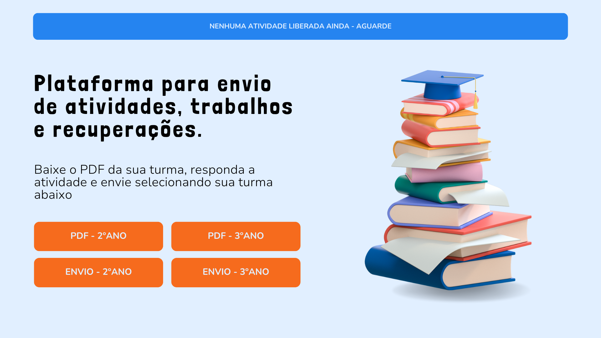

# :open_file_folder: Projeto de Página Web para Envio de Atividades Escolares. 
 

## 📌 Introdução
Este projeto foi desenvolvido para resolver um problema recorrente enfrentado por mim, como professor: a desorganização na gestão de atividades dos alunos ao final de cada bimestre. Após buscar soluções online e encontrar plataformas pagas ou excessivamente complicadas para os alunos, com necessidade de cadastro e login e uma interface nada simples, visto que muitos dos meus alunos têm pouca familiaridade com a informática, decidi criar uma página web simples, intuitiva e acessível para centralizar todas essas atividades.

 

## 📌 Objetivo
O objetivo principal é fornecer uma plataforma centralizada, onde meus alunos possam baixar suas atividades em PDF e enviá-las de maneira fácil e direta para um formulário do Google Forms. A página foi projetada para ser intuitiva, com uma interface limpa e poucos elementos, facilitando o uso. Além disso, essa plataforma elimina a necessidade de cadastros ou navegação por múltiplas páginas.  
Como estou estudando e aprendendo a utilizar as ferramentas do front-end, decidi por criar a página neste formato, podendo, além de colocar em prática o que estou aprendendo, resolver um problema do meu dia a dia, criando uma solução simples, mas que funcione.

 

## 📌 Design do Template

O template foi criado na plataforma Canva, A criação deste modelo visual é essencial para assegurar um design moderno, acessível e intuitivo, que facilita a navegação dos alunos. Ele destaca informações importantes, como a disponibilidade de atividades, e organiza as ações principais através de botões coloridos e bem posicionados. A imagem central de uma pilha de livros reforça o tema educacional, enquanto o design prioriza a responsividade e a experiência do usuário. Utilizar a criação do design antes de partir para o código, auxilia a entender como cada propriedade funcionará, como estruturar o HTML e organizar fontes e cores.  
Disponibilizei o acesso ao meus templates desse projeto para consulta. 
[Clique aqui para acessar!][6]

 

## 📌 Como o usuário deve usar 
  1. Imagine que você é aluno(a) do 2º ano do Ensino Médio. Você acessa a página, via link que disponibilizei em aula, e na `class="topo"` está escrito "Atividade de  Recuperação - envio até 20/09".
  2. Você irá clicar no botão `PDF - 2ºANO`, que baixará automaticamente o arquivo da atividade solicitada, em PDF, no seu dispositivo.
  3. A atividade solicitada é que você produza um texto sobre "A importância do trabalho na vida social". No PDF constará as orientações para produção da atividade, os textos que usamos em aula e as demais informações necessárias para realização da mesma.
  4.  Após a realização da sua atividade, com ela salva em seu dispositivo, você irá clicar no botão `ENVIO - 2ºANO` que abrirá, em outra guia, o formulário do Google Forms (ou qualquer outro drive e afins que achar melhor), para que você faça upload da atividade.

 ## 📌 Como o desenvolvedor deve usar 
   1. Após a geração dos códigos, adaptados para sua necessidade, você anexará o link do arquivo em PDF no `<a href="#linkDoPDF" download>`.
   2. E para o envio da atividade, basta criar um formulário no [Google Forms][1].
   3. Com o link do formulário pronto, basta anexar no `<a href="#linkParaEnvio">`.
   4. Não esqueça de alterar a descrição da `
`, adicionando que tipo de atividade está aberta para envio e até que data.

 

 ## 📌 Linguagens utilizadas

 

 

## 📌 Editor de código utilizado

![VS Code][7]

 

## 📌 Visualizar o projeto
A página está hospedada no GitHub Pages, que é um serviço que permite hospedar sites estáticos diretamente a partir de um repositório GitHub. É ideal para criar e publicar sites pessoais, blogs e portfólios.

[Clique aqui para visualizar!][5]

[1]: https://workspace.google.com/intl/pt-BR/lp/forms/?utm_source=google&utm_medium=cpc&utm_campaign=latam-BR-all-es-dr-BKWS-all-all-trial-e-dr-1707806-LUAC0020236&utm_content=text-ad-none-any-DEV_c-CRE_692948977897-ADGP_Hybrid%20%7C%20BKWS%20-%20EXA%20%7C%20Txt-Business-Forms-KWID_43700079700010382-kwd-2281725301160&utm_term=KW_formulario%20online%20google%20trabalho-ST_formulario%20online%20google%20trabalho&gad_source=1&gclid=Cj0KCQjwz7C2BhDkARIsAA_SZKY9p0p6X45-gGOxep8jvqADlPC_Tly3S8O6LftnZuwRttdoqyMXYY4aAlbpEALw_wcB&gclsrc=aw.ds
[2]: https://img.shields.io/badge/-HTML5-E34F26?style=for-the-badge&logo=html5&logoColor=white
[3]: https://img.shields.io/badge/-CSS3-1572B6?style=for-the-badge&logo=css3&logoColor=white
[4]: https://img.shields.io/badge/-JavaScript-fffd09?style=for-the-badge&logo=javascript&logoColor=black
[5]: https://danvasquesc.github.io/projeto-envio-de-atividades/
[6]: https://www.canva.com/design/DAGOazLU00I/mreLdF0DA6xNvEqz6jR10A/edit?utm_content=DAGOazLU00I&utm_campaign=designshare&utm_medium=link2&utm_source=sharebutton
[7]: https://img.shields.io/badge/Visual_Studio_Code-0078D4?style=for-the-badge

---

### Feito por [Dan!](https://github.com/danvasquesc) :sparkles: 
